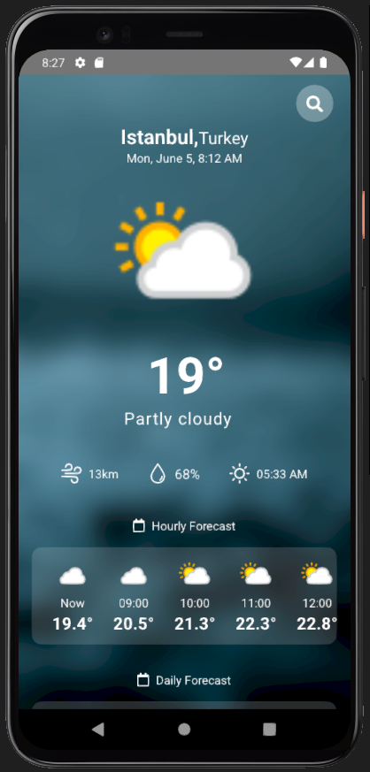
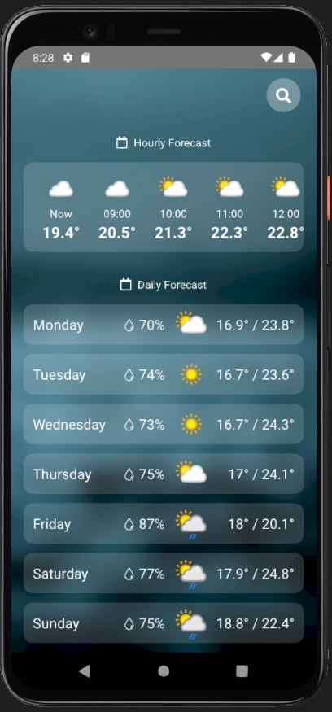

# Weather App

Bu React Native projesi, hava durumu bilgilerini gösteren bir mobil uygulamayı içermektedir. Uygulama, https://www.weatherapi.com/ API'sini kullanarak gerçek zamanlı hava durumu verilerini alır ve kullanıcıya sunar.

## Özellikler

- Konum bazlı hava durumu bilgilerini görüntüleme
- Anlık sıcaklık, nem oranı, rüzgar hızı gibi hava durumu verilerini gösterme
- Saatlik hava durumu bilgilerini görüntüleme
- Haftalık hava durumu tahminlerini görüntüleme

## Proje Kurulumu

1. Bu projeyi klonlayın veya indirin.
2. Proje dizinine gidin: `cd weather-app`
3. Gerekli bağımlılıkları yüklemek için `npm install` veya `yarn install` komutunu çalıştırın.
4. Android için: `npx react-native run-android` komutunu çalıştırın.
5. iOS için: `npx react-native run-ios` komutunu çalıştırın.

## Kullanım

- Uygulamayı başlattıktan sonra, konum izni istenecektir. Konum iznini kabul edin.
- Anasayfada, mevcut hava durumu bilgileri, saatlik ve haftalık hava durumu tahminleri görüntülenir.
- Farklı bir konumu görüntülemek için, arama çubuğunu kullanarak istediğiniz şehri veya konumu arayabilirsiniz.

## Ekran Görüntüleri

_Ana Sayfa_

_Konum Arama_

## Teknolojiler

- React Native
- WeatherApi API
- Axios (HTTP istekleri için)
- React Navigation (Navigasyon yönetimi için)
- Redux (Durum yönetimi için)
- Lodash (Fonksiyonel yardımcılar için)
- AsyncStorage (Veri saklama için)

## Katkıda Bulunma

Bu proje her türlü katkıya açıktır. Herhangi bir hata raporu, öneri veya katkıda bulunmak isterseniz, lütfen yeni bir "Issue" açın veya bir "Pull Request" gönderin.

## Lisans

Bu proje MIT Lisansı altında lisanslanmıştır. Daha fazla bilgi için `LICENSE` dosyasını inceleyin.
